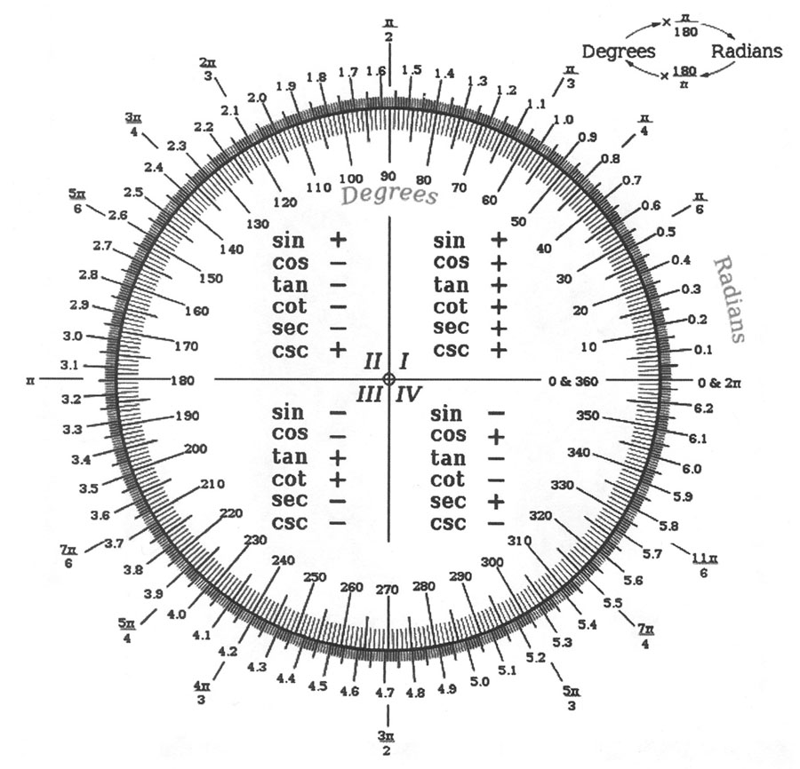

<h2 align="center">Elegant Curve generated by Chords</h2>

  <!--
  

    
  

  /-->

  

<h4 align="center">Реализация алгоритма построения <a href="https://en.wikipedia.org/wiki/Cardioid" target="blank">кардиоиды</a> хордами</h4>

  <code>programming</code>
  <code>algorithms</code>
  <code>olympic</code>
  <code>development</code>

---

#### Includes: ####
- [x] Programming task original definition [1998]
- [x] Task solution code which uses [Canvas API](https://developer.mozilla.org/en-US/docs/Web/API/Canvas_API)
- [x] Resolution screenshot
- [x] :point_right: [Live Demo](https://bit.ly/elegant-curv)

---

## Task definition ##

  

---

## Hints ##

  
Radian to Degrees Conversion Chart

  

    
  

---

> :calendar: Developed on **12th of June 2020**

:scorpius:
