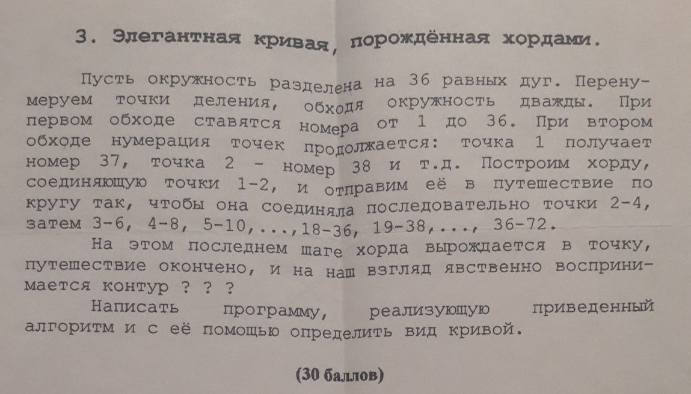

  <h2 align="center">Elegant Curve Generated by Chords</h2>

  

<!-- # Linux Configs :: Stack of useful .bashrc configs for OS Linux shell # -->

  <h4 align="center">Task from Schools Programming Olympiad</h4>

<!-- 

  

 -->

`programming` `algorythms` `olympic` `development`

#### Includes: ####
- [x] Programming task
- [x] Task resolution code which use [Canvas API](https://developer.mozilla.org/en-US/docs/Web/API/Canvas_API)
- [x] Resolution screenshot

---

## Task definition ##

  

---

## Hints ##

  
Radian to Degrees Conversion Chart

  

    
  

---

### :link: More Info ###

 - [GitHub / Basic writing and formatting syntax](https://help.github.com/articles/basic-writing-and-formatting-syntax/)
 - [BitBucket / Markdown Howto](https://bitbucket.org/tutorials/markdowndemo)

---

> :calendar: Developed on **12th of June 2020**

:scorpius:
